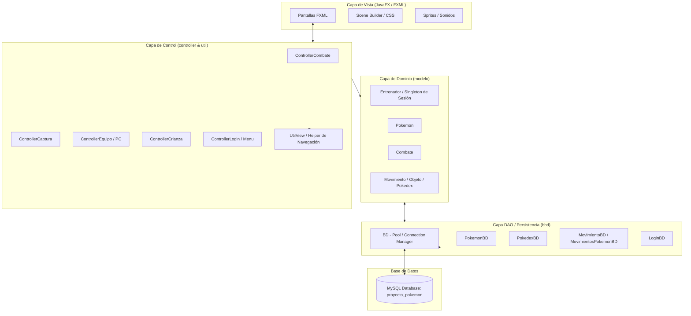
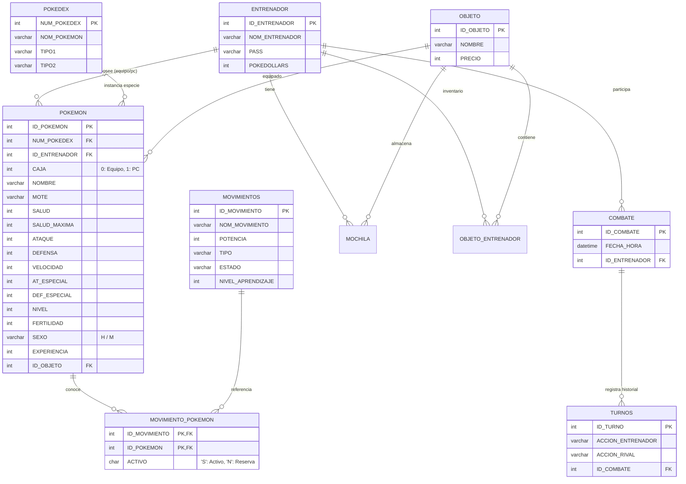

# 🎮 Pokémon DAM — Sistema Integral de Gestión y Combate Pokémon

[](https://www.oracle.com/java/)
[](https://openjfx.io/)
[](https://www.mysql.com/)
[](https://junit.org/junit5/)
[]()
[]()

Proyecto Final Integrador del **primer curso del Grado Superior en Desarrollo de Aplicaciones Multiplataforma (DAM)**. Desarrollado como una aplicación de escritorio completa en Java, implementando una arquitectura por capas basada en el patrón **MVC (Modelo-Vista-Controlador)**, persistencia relacional con **MySQL**, interfaz gráfica reactiva mediante **JavaFX / FXML** y una suite completa de pruebas unitarias con **JUnit 5**.

---

## 📌 Tabla de Contenidos

1. [Visión General del Proyecto](#-visión-general-del-proyecto)
2. [Pila Tecnológica y Herramientas](#-pila-tecnológica-y-herramientas)
3. [Arquitectura del Sistema](#-arquitectura-del-sistema)
4. [Diseño y Modelo de Datos (BBDD)](#-diseño-y-modelo-de-datos-bbdd)
5. [Módulos Funcionales y Mecánicas de Juego](#-módulos-funcionales-y-mecánicas-de-juego)
   - [Autenticación y Sesión de Entrenador](#1-autenticación-y-sesión-de-entrenador)
   - [Captura de Pokémon Salvajes](#2-captura-de-pokémon-salvajes)
   - [Motor de Combate por Turnos](#3-motor-de-combate-por-turnos)
   - [Sistema de Crianza Genética](#4-sistema-de-crianza-genética)
   - [Gestión de Equipo y Almacenamiento (PC)](#5-gestión-de-equipo-y-almacenamiento-pc)
   - [Centro Pokémon y Gestor de Movimientos](#6-centro-pokémon-y-gestor-de-movimientos)
   - [Entrenamiento y Progresión](#7-entrenamiento-y-progresión)
   - [Mochila y Tienda de Objetos](#8-mochila-y-tienda-de-objetos)
6. [Estructura del Proyecto y Paquetes](#-estructura-del-proyecto-y-paquetes)
7. [Pruebas Unitarias y Calidad (JUnit 5)](#-pruebas-unitarias-y-calidad-junit-5)
8. [Auditoría y Logging del Sistema](#-auditoría-y-logging-del-sistema)
9. [Instalación, Configuración y Despliegue](#-instalación-configuración-y-despliegue)
10. [Líneas Futuras y Escalabilidad](#-líneas-futuras-y-escalabilidad)
11. [Aprendizaje, Retos y Experiencia](#-aprendizaje-retos-y-experiencia)
12. [Autoría](#-autoría)

---

## 🚀 Visión General del Proyecto

El objetivo principal es materializar los conocimientos técnicos fundamentales adquiridos durante el 1º año de DAM:
- **Programación Orientada a Objetos (POO)**: encapsulamiento, polimorfismo, abstracción y composición.
- **Bases de Datos Relacionales**: normalización (3FN), integridad referencial, transacciones y consultas SQL complejas mediante JDBC.
- **Diseño de Interfaces de Usuario**: maquetación desacoplada con FXML, jerarquía de nodos JavaFX, CSS embebido y experiencia de usuario asíncrona mediante modales e hilos gráficos.
- **Control de Calidad**: desarrollo dirigido o validado por tests automatizados con JUnit 5 y simulación del entorno visual con `JFXPanel`.

El juego transporta las dinámicas clásicas de la franquicia Pokémon a una aplicación de escritorio robusta con persistencia de estado total en base de datos.

---

## 🛠 Pila Tecnológica y Herramientas

| Componente | Tecnología | Detalle de Uso |
| :--- | :--- | :--- |
| **Lenguaje** | **Java (JDK 17 / 21)** | Lógica de negocio orientada a objetos, colecciones, streams y lambdas. |
| **Interfaz Gráfica (GUI)** | **JavaFX 21 + Scene Builder** | Vistas declarativas en archivos `.fxml`, layouts responsivos (`BorderPane`, `AnchorPane`, `FlowPane`). |
| **Base de Datos** | **MySQL 8.0 / MariaDB 10.4+** | Almacenamiento persistente, claves foráneas, borrado en cascada y triggers lógicos. |
| **Acceso a Datos** | **JDBC (`java.sql.*`)** | Driver `mysql-connector-j`, sentencias parametrizadas (`PreparedStatement`) para evitar SQL Injection. |
| **Testing** | **JUnit 5 Jupiter** | Pruebas unitarias de controladores, modelos y flujos de negocio. |
| **Logging** | **`java.util.logging`** | Registro estructurado de auditoría de combates a fichero local (`controller_combate.log`). |
| **Multimedia** | **JavaFX Media / Image API** | Carga dinámica de recursos gráficos (sprites delantero/trasero) y reproducción de audio `.mp3`. |

---

## 📐 Arquitectura del Sistema

El software implementa una variante robusta del patrón **MVC (Model-View-Controller)** complementada con un patrón **DAO (Data Access Object)** para desacoplar totalmente la interfaz gráfica de las operaciones de base de datos.



### Patrones de Diseño Aplicados:
1. **Singleton Pattern**:
   - `BD.java`: Centraliza y reutiliza la instancia de `java.sql.Connection` para optimizar los accesos a MySQL.
   - `Entrenador.getEntrenadorActual()`: Mantiene la sesión global del usuario autenticado en memoria mientras navega por las distintas pantallas.
2. **Transfer Object / Data Transfer Pattern**:
   - `ControllerWithAttributes.java`: Clase abstracta que permite la transferencia segura de objetos entre controladores al abrir vistas secundarias o modales (`initializeAttributes(Object data)`).
3. **Event-Driven Architecture**:
   - Eventos de JavaFX (`EventHandler<MouseEvent>`, `EventHandler<ActionEvent>`) desacoplados con clases anónimas o internas especializadas (`ManejaMousePokemon`, `ManejaMovimientoLucha`).
4. **DAO (Data Access Object)**:
   - Todo el código SQL está estrictamente confinado en el paquete `bbd`, aislando las reglas de negocio de la sintaxis SQL.

---

## 🗄 Diseño y Modelo de Datos (BBDD)

La base de datos relacional `proyecto_pokemon` está estructurada para garantizar integridad referencial y atomicidad.

### Diagrama Entidad-Relación (DER)



### Diccionario de Datos Principal

- **`entrenador`**: Credenciales de acceso, nombre de usuario y billetera en PokéDólares.
- **`pokedex`**: Catálogo base maestro con las 50 especies iniciales de Pokémon y sus afinidades elementales (Tipo 1 y Tipo 2).
- **`pokemon`**: Instancias concretas de cada Pokémon capturado o criado. Almacena IVs/estadísticas actuales, estado, nivel, experiencia, fertilidad (máx. 5 puntos) y caja de ubicación (`0` para equipo de combate, `1` para PC de almacenamiento).
- **`movimientos`**: Catálogo de más de 70 ataques con potencia, tipo elemental, nivel requerido de aprendizaje y efectos secundarios.
- **`movimiento_pokemon`**: Tabla de ruptura N:M que gestiona el moveset de cada espécimen, distinguiendo movimientos activos (máximo 4 con flag `'S'`) de los movimientos aprendidos en reserva (flag `'N'`).
- **`combate` & `turnos`**: Registro de auditoría para estadísticas y logs de batallas efectuadas.

---

## 🕹 Módulos Funcionales y Mecánicas de Juego

### 1. Autenticación y Sesión de Entrenador
- **Registro y Acceso**: Validación de credenciales contra la base de datos mediante sentencias SQL parametrizadas para evitar inyección de código.
- **Carga de Estado**: Al iniciar sesión con éxito, la instancia Singleton `Entrenador` hidrata desde la BBDD todo su inventario, saldo y equipo activo (Caja 0) y PC (Caja 1).

### 2. Captura de Pokémon Salvajes
- **Aparición Aleatoria**: Selección aleatoria de una especie de la tabla `pokedex`.
- **Probabilidad de Captura**: Algoritmo determinista de captura con ratio del **60%**:
  $$\text{Éxito} \iff \text{Random}(1, 100) \le 60$$
- **Personalización y Guardado**: Posibilidad de ingresar un mote personalizado mediante un diálogo modal (`TextInputDialog`). Si el equipo tiene menos de 6 miembros va directamente a la formación activa; en caso contrario, se envía automáticamente al PC (capacidad máxima de 30).
- **Generación de Estadísticas Base**: Se inicializan aleatoriamente sus valores individuales (IVs/Stats) de salud, ataque, defensa y velocidad según rangos balanceados.

### 3. Motor de Combate por Turnos
- **Generación Procedural del Rival**: Se genera dinámicamente un oponente ("Dominguero") cuyo equipo escala proporcionalmente al nivel más alto del equipo del jugador.
- **Mecánica de Batalla**:
  1. Selección del "Paladín" (Pokémon activo del jugador que posea salud $> 0$).
  2. Selección de ataque entre los 4 movimientos activos disponibles en la botonera dinámica.
  3. Cálculo de daño directo sobre el Pokémon rival según la potencia del movimiento.
  4. Si el rival sobrevive, calcula una respuesta aleatoria mediante IA básica con sus movimientos disponibles.
  5. Actualización reactiva de barras de vida (`ProgressBar`) y sprites en tiempo real.
- **Condición de Victoria / Derrota**:
  - Si el rival cae, se avanza secuencialmente a su siguiente Pokémon (hasta 6).
  - Al vencer al equipo completo rival: todos los Pokémon del equipo reciben experiencia acumulativa (`subirExperienciaEntrenador`) y el jugador gana **500 PokéDólares** ("Robar Cartera").

### 4. Sistema de Crianza Genética
- **Control Biológico Riguroso**:
  - Exige un progenitor Macho (`'M'`) y una progenitora Hembra (`'H'`).
  - Ambos deben pertenecer estrictamente a la **misma especie** (`padre.getNombre().equals(madre.getNombre())`).
  - Ambos progenitores deben disponer de puntos de **fertilidad** ($\text{fertilidad} > 0$).
- **Mecánica**:
  - Consume 1 punto de fertilidad en cada progenitor y persiste el cambio.
  - Genera una cría a Nivel 1, asignándole mote personalizado e integrándola en el equipo o PC.

### 5. Gestión de Equipo y Almacenamiento (PC)
- **Equipo Activo (Máx. 6)**: Panel visual interactivo con los sprites de los 6 Pokémon activos.
- **PC de Almacenamiento (Máx. 30)**: Cuadrícula con capacidad para 30 ejemplares.
- **Inspección de Estadísticas**: Al hacer clic sobre cualquier Pokémon, se abre un modal con el desglose de todas sus estadísticas (Salud, Salud Máxima, Ataque, Defensa, Velocidad, Ataque Especial, Defensa Especial, Nivel, Sexo).
- **Acciones Rápidas**:
  - *Mover*: Alterna el espécimen entre Equipo (Caja 0) y PC (Caja 1) controlando límites de cupo.
  - *Vender*: Permite vender un Pokémon al mercado negro por **1.000 PokéDólares**.
  - *Liberar*: Elimina de forma definitiva al Pokémon y sus movimientos asociados de la BBDD.

### 6. Centro Pokémon y Gestor de Movimientos
- **Curación Instantánea**: Restaura la salud de todos los Pokémon del equipo al 100% de su `SALUD_MAXIMA` y persiste el estado en MySQL.
- **Recordador de Movimientos (Moveset Manager)**:
  - Permite configurar los **4 movimientos activos** en batalla.
  - Muestra la lista de movimientos activos (`boxActivos`) frente a los movimientos aprendidos en reserva (`boxAprendidos`).
  - Permite activar o desactivar movimientos con un solo clic, sincronizando en caliente el campo `ACTIVO = 'S'/'N'` en `movimiento_pokemon`.

### 7. Entrenamiento y Progresión
- **Subida de Nivel**:
  - Curva de nivel lineal/proporcional:
    $$\text{Nivel Up} \iff \text{Experiencia} \ge 10 \times \text{Nivel}$$
  - Al subir de nivel, los atributos crecen proceduralmente: Salud (+11 a +15), Ataque, Defensa, Ataque Especial, Defensa Especial y Velocidad (+1 a +5).
  - **Aprendizaje Automático**: Si el nuevo nivel coincide con el `NIVEL_APRENDIZAJE` de nuevos movimientos de sus tipos elementales, el Pokémon los aprende automáticamente.

### 8. Mochila y Tienda de Objetos
- Adquisición de objetos consumibles y potenciadores (Anillo Único, Bastón, Chaleco, Pesa, Éter, Pila, Pluma) descontando fondos de la billetera del entrenador.

---

## 📂 Estructura del Proyecto y Paquetes

```text
proyecto-pokemon/
├── .project                     # Descriptor del proyecto Eclipse
├── build.fxbuild                # Configuración de compilación JavaFX
├── controller_combate.log       # Registro estructurado de auditoría (Log de combate)
│
├── src/
│   ├── application/
│   │   └── Main.java            # Punto de entrada de la aplicación JavaFX (start, launch)
│   │
│   ├── bbd/                     # Capa de Acceso a Datos (DAO / JDBC)
│   │   ├── BD.java              # Gestor Singleton de conexión a MySQL
│   │   ├── LoginBD.java         # Verificación y registro de usuarios
│   │   ├── PokemonBD.java       # CRUD completo de instancias Pokémon y estadísticas
│   │   ├── PokedexBD.java       # Consultas maestras a la Pokédex
│   │   ├── MovimientoBD.java    # Consultas de movimientos por nivel y tipo
│   │   ├── MovimientosPokemonBD.java # Gestión de la relación N:M movimientos-pokemon
│   │   └── proyecto_pokemon.sql # Script DDL/DML de la base de datos relacional
│   │
│   ├── controller/              # Capa de Controladores JavaFX
│   │   ├── ControllerLogin.java
│   │   ├── ControllerMenu.java
│   │   ├── ControllerCombate.java
│   │   ├── ControllerCaptura.java
│   │   ├── ControllerEquipo.java
│   │   ├── ControllerPc.java
│   │   ├── ControllerCentroPokemon.java
│   │   ├── ControllerEntrenamiento.java
│   │   ├── ControllerCrianza.java
│   │   ├── ControllerCrianzaSecundario.java
│   │   ├── ControllerEstadisticas.java
│   │   ├── ControllerRecuerdaMovimientos.java
│   │   ├── ControllerMochila.java
│   │   ├── ControllerElegirEquipo.java
│   │   └── ControllerWithAttributes.java # Puente polimórfico para modales
│   │
│   ├── modelo/                  # Capa de Dominio (Entidades de Negocio)
│   │   ├── Entrenador.java      # Estado del jugador, equipo, PC y operaciones
│   │   ├── Pokemon.java         # Entidad Pokémon: stats, nivel, salud, movesets
│   │   ├── Combate.java         # Motor de combate, turnos, rivales y cálculo de daños
│   │   ├── Movimiento.java      # Atributos del movimiento (potencia, tipo, etc.)
│   │   ├── Objeto.java          # Equipamiento e ítems de la tienda
│   │   ├── Pokedex.java         # Especie base (número, nombre, tipos)
│   │   ├── Tipo.java            # Enumerado de tipos elementales
│   │   └── Musica.java          # Reproductor de audio de fondo
│   │
│   ├── util/                    # Utilidades transversales
│   │   └── UtilView.java        # Helper de vistas, carga FXML, alertas y sprites
│   │
│   ├── vistas/                  # Vistas declarativas (JavaFX FXML)
│   │   ├── PantallaLogin.fxml
│   │   ├── PantallaMenuPrincipal.fxml
│   │   ├── PantallaCombate.fxml
│   │   ├── PantallaCaptura.fxml
│   │   ├── PantallaEquipo.fxml
│   │   ├── PantallaPC.fxml
│   │   ├── PantallaCentroPokemon.fxml
│   │   ├── PantallaEntrenamiento.fxml
│   │   ├── PantallaCrianza.fxml
│   │   ├── PantallaMenuCrianzaSecundaria.fxml
│   │   ├── PantallaEstadisticas.fxml
│   │   ├── PantallaRecuerdaMovimientos.fxml
│   │   ├── PantallaMochilaTienda.fxml
│   │   └── PantallaElegirEquipo.fxml
│   │
│   ├── imagenes/                # Recursos gráficos (delante, detrás, fondos, UI)
│   └── sonidos/                 # Recursos de audio (.mp3)
│
└── test/
    └── pruebasJUnit5/           # Batería de Pruebas Unitarias Automatizadas
        ├── ControllerCentroPokemonTest.java
        ├── ControllerMochilaTest.java
        ├── ControllerEquipoTest.java
        ├── ControllerPcTest.java
        ├── ControllerEntrenamientoTest.java
        ├── ControllerCrianzaTest.java
        ├── ControllerCrianzaSecundarioTest.java
        ├── ControllerElegirEquipoTest.java
        ├── ControllerMenuTest.java
        ├── ControllerRecuerdaMovimientosTest.java
        └── controllerCapturaTest.java
```

---

## 🧪 Pruebas Unitarias y Calidad (JUnit 5)

La suite de pruebas en el directorio `test/pruebasJUnit5` asegura la robustez de los controladores y modelos:

- **Inicialización del Entorno Gráfico**: Al probar componentes de JavaFX fuera de la aplicación tradicional, se utiliza `new JFXPanel()` en métodos anotados con `@BeforeAll`, inicializando el `JavaFX Application Thread` y previniendo errores del tipo `IllegalStateException: Toolkit not initialized`.
- **Casos de Prueba Clave**:
  - `testCurar()`: Valida la recuperación integral de PS del equipo tras la visita al Centro Pokémon.
  - `testAnillo()` y `testFondosInsuficientes()`: Valida transacciones de compra en la tienda, verificando que los fondos se descuenten si hay saldo suficiente y se bloquee la transacción si el dinero es insuficiente.
  - Pruebas de integración de apertura modal y manejo de eventos `assertDoesNotThrow(...)`.

---

## 📝 Auditoría y Logging del Sistema

El módulo de combate incorpora un subsistema de logging mediante la API estándar `java.util.logging.Logger`.

- **Destino**: Archivo físico `controller_combate.log`.
- **Configuración**: `FileHandler` en modo append (`true`) con `SimpleFormatter`.
- **Trazabilidad**:
  - Instanciación y refresco de participantes.
  - Selección de movimientos por parte del jugador y de la IA del rival.
  - Registro de noqueos (`INFO: Has derrotado a Diglett`).
  - Derrotas de Pokémon aliados (`WARNING: Tu pokémon Pepe ha muerto`).
  - Balance de victoria / derrota y adjudicación de premios.

---

## ⚙️ Instalación, Configuración y Despliegue

### 1. Requisitos Previos
- **Java Development Kit (JDK)**: Versión 17 o 21 instalada y configurada en el `JAVA_HOME`.
- **JavaFX SDK**: Versión 21 (si se ejecuta fuera de un entorno con JavaFX embebido).
- **Servidor MySQL**: XAMPP, WampServer o MySQL Server 8.0+.
- **IDE Recomendado**: Eclipse IDE for Java Developers o IntelliJ IDEA con soporte para JavaFX.

### 2. Configuración de la Base de Datos
1. Inicia los servicios de MySQL (por ejemplo, desde el panel de control de XAMPP).
2. Accede a **phpMyAdmin** (`http://localhost/phpmyadmin`) o a tu cliente MySQL preferido (MySQL Workbench, DBeaver, HeidiSQL).
3. Crea la base de datos:
   ```sql
   CREATE DATABASE proyecto_pokemon CHARACTER SET utf8mb4 COLLATE utf8mb4_general_ci;
   ```
4. Importa el archivo SQL ubicado en el repositorio:
   ```text
   src/bbd/proyecto_pokemon.sql
   ```
5. Si tus credenciales de MySQL son distintas a las configuradas por defecto (`usuario: root`, `sin contraseña`, puerto `3306`), ajusta los parámetros en `src/bbd/BD.java`:
   ```java
   String url = "jdbc:mysql://localhost:3306/proyecto_pokemon";
   String usuario = "root";
   String contraseña = "";
   ```

### 3. Ejecución desde el IDE
1. Importa el proyecto en tu IDE como proyecto Java existente.
2. Asegúrate de que las librerías de JavaFX y el conector JDBC (`mysql-connector-j-x.x.x.jar`) se encuentren en el **Classpath / Modulepath**.
3. Localiza la clase principal: `src/application/Main.java`.
4. Ejecuta como **Java Application**.

---

## 🚀 Líneas Futuras y Escalabilidad

Como base orientada hacia el segundo curso de DAM, el proyecto admite las siguientes extensiones naturales:
- **Seguridad Criptográfica**: Incorporar hashing y salt con **BCrypt** para el almacenamiento de contraseñas de entrenadores.
- **Multijugador en Red (Sockets)**: Implementar una arquitectura cliente-servidor mediante Sockets TCP/IP o WebSockets para permitir combates PvP en tiempo real.
- **Matriz de Efectividades Completa**: Integrar la tabla de tipos elementales con multiplicadores de daño ($\times 2.0$, $\times 0.5$, $\times 0.0$).
- **Migración a ORM**: Evolucionar la capa DAO manual a **Hibernate / JPA** para simplificar la gestión transaccional.

---

## 💡 Aprendizaje, Retos y Experiencia

El desarrollo integral de este proyecto como cierre del primer curso de **DAM** ha supuesto un punto de inflexión en mi formación como desarrollador de software:

* **Consolidación Teórico-Práctica**: Pasar de resolver ejercicios de programación aislados a concebir y estructurar una arquitectura de software completa de principio a fin. La implementación del patrón **MVC** junto con la capa **DAO** me permitió asimilar en profundidad la importancia del bajo acoplamiento, la alta cohesión y la responsabilidad única, facilitando el mantenimiento y la escalabilidad del código.
* **Integración Relacional y Persistencia con JDBC**: Diseñar la base de datos normalizada en MySQL y gestionarla mediante JDBC supuso interiorizar cómo mapear objetos Java a tablas relacionales de forma manual, controlando transacciones, claves ajenas compuestas y relaciones complejas de muchos a muchos (como el moveset de cada Pokémon), además de asegurar las consultas mediante sentencias preparadas (`PreparedStatement`).
* **Dominio de Interfaces Reactivas con JavaFX**: Maquetar de forma declarativa con FXML y Scene Builder, coordinar la apertura de ventanas modales con inyección polimórfica de datos (`ControllerWithAttributes`) y gestionar los eventos del usuario de forma reactiva (barras de vida en tiempo real, cambio dinámico de sprites y alertas de diálogo).
* **Retos Técnicos Superados**:
  * *Sincronización en tiempo real*: Garantizar que los cambios en la interfaz gráfica (capturar, subir de nivel, mover entre cajas o vencer en batalla) se reflejaran de manera inmediata tanto en la memoria de la aplicación (sesión activa del entrenador) como en la persistencia física en MySQL sin provocar inconsistencias ni desfases de datos.
  * *Motor de Combate y Control de Flujo*: Desarrollar la máquina de estados por turnos para el combate Pokémon, implementando la IA básica del rival, el escalado procedimental de dificultad, el cálculo de daño y la gestión de noqueos con un sistema de auditoría estructurado en logs (`java.util.logging`).
  * *Testing en Entornos Gráficos*: Resolver el desafío de ejecutar pruebas unitarias con **JUnit 5** sobre controladores desacoplados del ciclo de vida estándar de la aplicación mediante la inicialización controlada del Toolkit con `JFXPanel`.
* **Experiencia Global**: Afrontar este proyecto ha fortalecido enormemente mi capacidad analítica, mi autonomía en la resolución de problemas y mi disciplina de depuración. Ha transformado la programación en una herramienta tangible para materializar sistemas complejos, dejándome una base sólida y una gran motivación para encarar los retos del segundo curso de DAM y el entorno profesional.

---

## 👨‍💻 Autoría

Proyecto desarrollado por:
- **Diego Antonio Alcaraz Lopez** (*Diegolivejr*) — Alumno de 1º de Desarrollo de Aplicaciones Multiplataforma (DAM).
